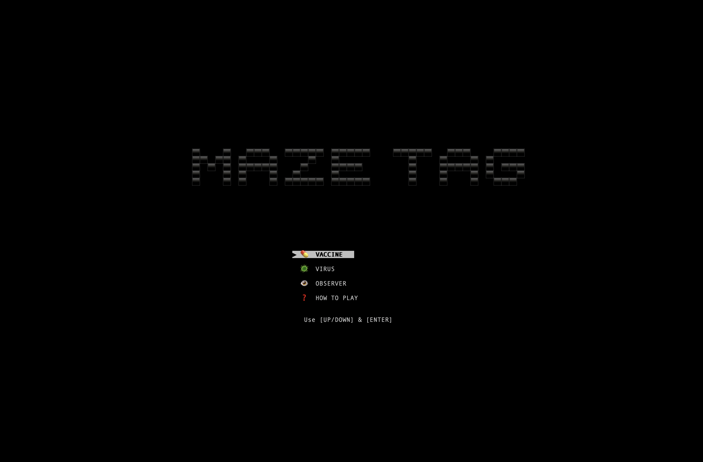
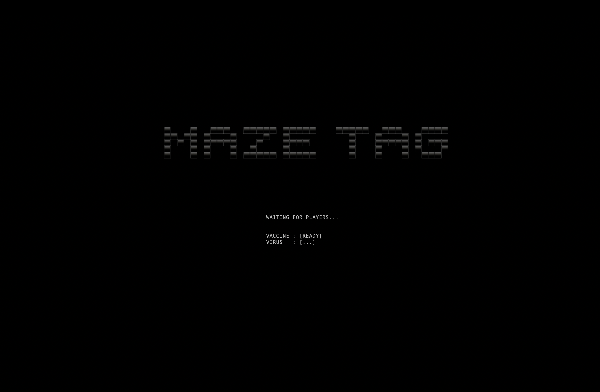
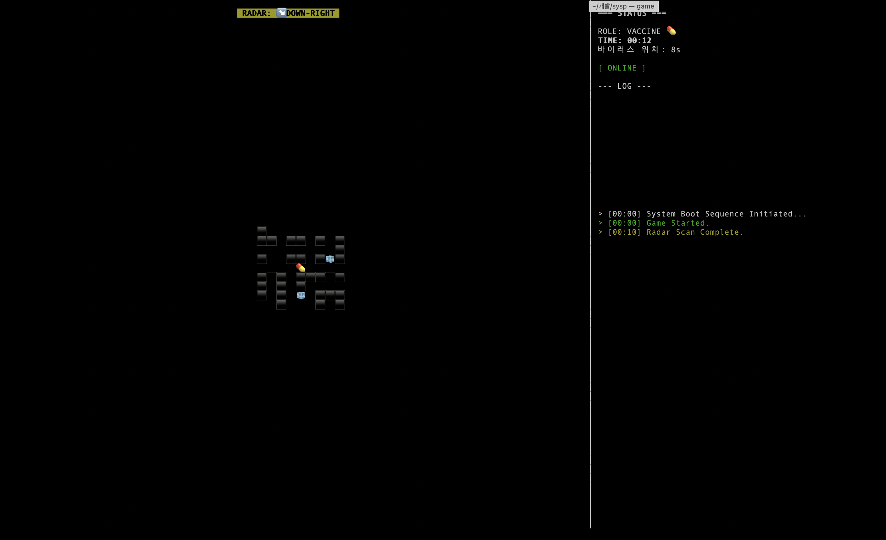
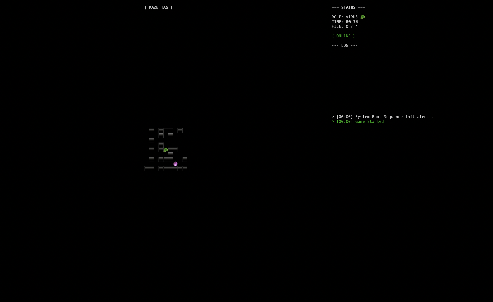
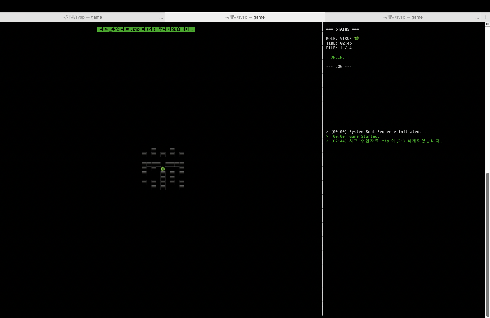
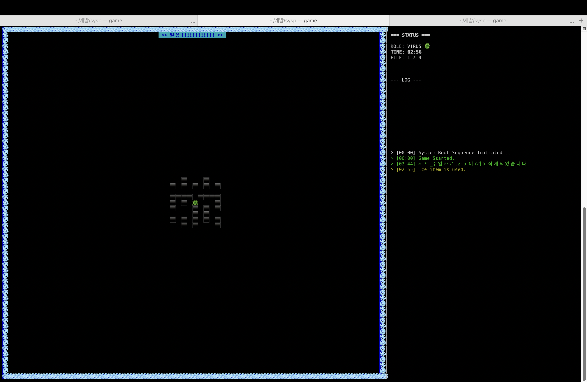

<a name="readme-top"></a>
<div id="readme-top"></div>

[![Contributors][contributors-shield]][contributors-url]
[![Forks][forks-shield]][forks-url]
[![Stargazers][stars-shield]][stars-url]
[![Issues][issues-shield]][issues-url]
[![License][license-shield]][license-url]

<br />
<div align="center">
  <h3 align="center">MAZE TAG</h3>

  <p align="center">
    멀티캐스트 기반 터미널 미로 술래잡기
    <br />
    <a href="#about-the-project"><strong>프로젝트 소개 보기 »</strong></a>
    <br />
    <br />
    <a href="#usage">게임 방법</a>
    ·
    <a href="#getting-started">빌드 및 실행</a>
    ·
    <a href="#team">팀원 정보</a>
  </p>
</div>

<details>
  <summary>목차</summary>
  <ol>
    <li>
      <a href="#about-the-project">프로젝트 소개</a>
      <ul>
        <li><a href="#built-with">사용 기술</a></li>
      </ul>
    </li>
    <li>
      <a href="#getting-started">시작하기</a>
      <ul>
        <li><a href="#prerequisites">필수 요구사항</a></li>
        <li><a href="#installation">빌드 및 실행</a></li>
      </ul>
    </li>
    <li><a href="#usage">게임 규칙 및 조작법</a></li>
    <li><a href="#features">주요 기능</a></li>
    <li><a href="#team">팀원 정보</a></li>
  </ol>
</details>

<h2 id="about-the-project">About The Project</h2>



**MAZE TAG**는 리눅스/유닉스 환경의 터미널에서 즐기는 실시간 멀티플레이어 미로 술래잡기 게임입니다.
중앙 서버 없이 **UDP 멀티캐스트(Multicast)** 통신을 활용하여 P2P 방식으로 동작하며, `ncurses` 라이브러리를 통해 화려한 TUI(Text User Interface)를 제공합니다.

플레이어는 **백신(Vaccine)** 또는 **바이러스(Virus)**가 되어, 좁은 시야 속에서 서로를 쫓거나 도망쳐야 합니다.

<p align="right">(<a href="#readme-top">back to top</a>)</p>

<h3 id="built-with">Built With</h3>

이 프로젝트는 다음 기술을 사용하여 제작되었습니다.

* **C Language**
* **ncurses Library** (UI 렌더링)
* **POSIX Threads** (비동기 통신 처리)
* **BSD Sockets** (UDP Multicast 통신)

<p align="right">(<a href="#readme-top">back to top</a>)</p>

<h2 id="getting-started">Getting Started</h2>

게임을 실행하기 위해 다음 단계에 따라 환경을 설정해주세요.

<h3 id="prerequisites">Prerequisites</h3>

이 게임은 `ncurses` 라이브러리를 사용합니다. 실행 전 라이브러리 설치가 필요할 수 있습니다.

* **Ubuntu/Linux**
    ```sh
    sudo apt-get install libncurses5-dev libncursesw5-dev
    ```
* **macOS**
    ```sh
    # macOS는 기본적으로 ncurses가 내장되어 있거나 Homebrew를 통해 설치 가능합니다.
    brew install ncurses
    ```

<h3 id="installation">Installation & Build</h3>

1.  레포지토리를 클론합니다.
    ```sh
    git clone [https://github.com/your_username/repo_name.git](https://github.com/your_username/repo_name.git)
    cd repo_name
    ```
2.  `make` 명령어를 사용하여 빌드합니다. (Makefile이 없는 경우 아래 gcc 명령어 사용)
    ```sh
    make
    ```
    * **수동 컴파일 명령어:**
        ```sh
        # Linux
        gcc -Wall -g game.c -o game -lncursesw -lpthread -lm

        # macOS
        gcc -Wall -g game.c -o game -lncurses -lpthread -lm
        ```
3.  게임을 실행합니다.
    ```sh
    ./game
    ```

<p align="right">(<a href="#readme-top">back to top</a>)</p>

<h2 id="usage">Usage</h2>

### 게임 실행 방법
이 게임은 로컬 네트워크(멀티캐스트 지원 환경)에서 2명 이상의 플레이어가 필요합니다.

1.  같은 네트워크 환경에서 터미널 2개 이상을 엽니다.
2.  각 터미널에서 `./game`을 실행합니다.
3.  **역할 선택 화면**에서 각자 역할을 선택합니다.
    * 플레이어 1: **Vaccine (Host)** 선택
    * 플레이어 2: **Virus (Join)** 선택
    * 관전자: **OBSERVER** 선택

<table>
  <tr>
    <td align="center">
      
      <br />
      <b>[메인 화면]</b>
    </td>
    <td align="center">
      
      <br />
      <b>[대기 화면]</b>
    </td>
  </tr>
</table>

### 조작법

| 키 | 동작 |
| --- | --- |
| **방향키 (↑, ↓, ←, →)** | 캐릭터 이동 / 메뉴 이동 |
| **Enter** | 메뉴 선택 |
| **Q** | 게임 종료 / 나가기 |

### 게임 규칙

* **백신 (Vaccine 💊)**: 술래
    * **목표:** 바이러스를 찾아 잡아야 합니다.
    * **특수 능력:** 레이더 (10초마다 바이러스의 방향을 감지하여 알려줍니다).
* **바이러스 (Virus 🦠)**: 도망자
    * **목표:** 맵에 숨겨진 **파일(💾)** 4개를 모두 찾아 삭제(획득)해야 합니다.
    * **패배 조건:** 파일을 모두 모으기 전에 백신에게 잡히면 패배(삭제)됩니다.

<table>
  <tr>
    <td align="center">
      
      <br />
      <b>[백신 화면]</b>
    </td>
    <td align="center">
      
      <br />
      <b>[바이러스 화면]</b>
    </td>
  </tr>
</table>

### 아이템

* **파일 (💾)**: 바이러스의 승리 목표물 (백신에게는 보이지 않음).
* **텔레포트 (🔮)**: 획득 시 맵의 랜덤한 위치로 즉시 이동합니다.
* **얼음 (🧊)**: 획득 시 상대방을 3초간 **동결(Freeze)** 시킵니다.

<table>
  <tr>
    <td align="center">
      
      <br />
      <b>[파일]</b>
    </td>
    <td align="center">
      
      <br />
      <b>[얼음]</b>
    </td>
  </tr>
</table>

<p align="right">(<a href="#readme-top">back to top</a>)</p>

<h2 id="features">Key Features</h2>

* **P2P 멀티캐스트 통신**: 별도의 서버 구축 없이 동일 네트워크 상에서 즉시 멀티플레이 가능.
* **랜덤 미로 생성**: 매 게임마다 DFS 알고리즘을 이용해 새로운 미로가 생성됩니다.
* **시야 제한 (Fog of War)**: 플레이어 주변 반경만 볼 수 있어 긴장감 넘치는 플레이 가능.
* **시스템 삭제 연출**: 패배 시 `System32` 삭제를 모방한 페이크 에러 연출 효과.
* **관전 모드**: 게임에 참여하지 않고 전체 상황을 지켜볼 수 있는 옵저버 모드 지원.

<p align="right">(<a href="#readme-top">back to top</a>)</p>

<h2 id="team">Team Info</h2>

**시스템 프로그래밍 002분반 18조 청바지**

* **팀장**: 정덕환 (22학번) - Tech Lead & System Integration
* **팀원**: 김건우 (24학번) - Vaccine Logic & UX
* **팀원**: 김민준 (24학번) - Virus Logic & QA

<p align="right">(<a href="#readme-top">back to top</a>)</p>

[contributors-shield]: https://img.shields.io/badge/contributors-Team-orange.svg?style=for-the-badge
[contributors-url]: #
[forks-shield]: https://img.shields.io/badge/forks-0-blue.svg?style=for-the-badge
[forks-url]: #
[stars-shield]: https://img.shields.io/badge/stars-0-yellow.svg?style=for-the-badge
[stars-url]: #
[issues-shield]: https://img.shields.io/badge/issues-0-red.svg?style=for-the-badge
[issues-url]: #
[license-shield]: https://img.shields.io/badge/license-MIT-green.svg?style=for-the-badge
[license-url]: #